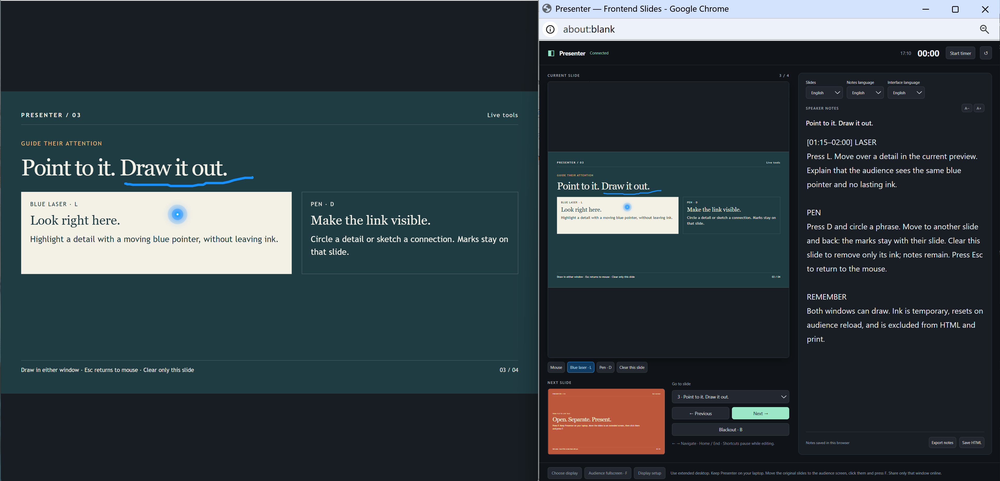

# Frontend Slides Presenter

An agent skill that adds speaker notes and a dual-window Presenter Mode to
[Frontend Slides](https://github.com/zarazhangrui/frontend-slides) HTML
presentations—without replacing the deck's design, animations, or navigation.

## What This Does

**Frontend Slides Presenter** turns the original slides window into a clean
audience display and opens a separate presenter window for the speaker.
Everything remains local and can still be delivered as one portable HTML file.

<a href="https://fangningshao.github.io/frontend-slides-presenter/" title="Open the multilingual Frontend Slides Presenter demo">
	
</a>

> **[Open the multilingual live demo →](https://fangningshao.github.io/frontend-slides-presenter/)** — switch the slides,
> presenter interface, and speaker notes among English, 中文, 日本語, 한국어,
> Español, Français, Deutsch, العربية, and Português. Built by this skill. Source in [demo/index.html](demo/index.html).

### Key Features

- **Two synchronized windows** — Keep the audience view on the projector and
	Presenter Mode on the laptop.
- **Per-slide speaker notes** — Edit notes while presenting, retain drafts in
	browser storage, and save them into a portable HTML file.
- **Current and next previews** — See where the talk is and what comes next.
- **Presentation controls** — Navigate, jump to a slide, manage the timer,
	change note size, and temporarily black out the audience display.
- **Laser and pen tools** — Point or draw in either window with synchronized,
	per-slide annotations.
- **No web runtime dependency** — The presenter runtime is embedded directly
    into the deck, which is pure frontend, without backend dependencies.
- **Pluggable with your favourite frontend-slides skills** — This skill works
    well together with your 1frontend-slides skill or your localized version.

## Installation

Simply ask your coding agent: 

```
Help me install this skill: https://github.com/fangningshao/frontend-slides-presenter
```

Alternatively: clone or copy this repository into the skills directory used by your coding
agent. For example, for your Claude Code installation:

```bash
git clone https://github.com/fangningshao/frontend-slides-presenter ~/.claude/skills/frontend-slides-presenter
```

Coding agents can use the repository directly. Ask the agent to start
from `SKILL.md`; it will load `references/integration.md`,
`assets/presenter.js`, and `scripts/embed.py` when needed.

This is an extension for Frontend Slides. Install or otherwise make the
[Frontend Slides skill](https://github.com/zarazhangrui/frontend-slides)
available when creating a new deck. Existing compatible HTML decks can be
extended directly.

## Usage

### 1. Creating a new slide

Invoke the installed skill and describe the deck to create:

```text
/frontend-slides-presenter

> "Help me create slides that introduces the CosyVoice3 architecture."
```

The agent will:

1. Search the web and collect materials if needed.
2. Create frontend slides using the existing frontend-slides skill.
3. Draft your presenter notes for each slide.
4. Embed the presenter runtime into the output HTML to make it presentable.


### 2. Updating an existing frontend slide

You can also use this skill with existing slides:

```text
/frontend-slides-presenter

> "Here's my slides: demo.html. Here is my voice transcript: transcript.txt. Now embed it into my slides for a presenter mode."
```

The agent will:

1. Read your slides and your transcripts to get an overall understanding.
2. Draft your presenter notes for each slide.
3. Embed the presenter runtime into your original slides HTML to make it presentable.


## Presenting

### Present locally with extended desktop
1. Connect the projector and enable **extended desktop** rather than mirroring.
2. Open the generated HTML file in a browser.
3. Press **P** or click the Presenter control to open Presenter Mode.
4. Keep Presenter Mode on the laptop and move the original slides window to
	 the projector.
5. Click the audience window and press **F** to enter fullscreen.

### Present online

In Zoom, Microsoft Teams, Skype, Tencent Meeting, or similar apps:

1. Press **P** to open the separate Presenter view. Now the presenter view and the main view are in different windows on your computer.
2. Share only the original main slides window to your Zoom/Teams software.
3. Your audience sees the clean presentation while you privately see notes and controls.

### Shortkeys
When presenting, use:

| Key or control | Action |
| --- | --- |
| Arrow keys / Space | Previous or next slide |
| Home / End | First or last slide |
| B | Toggle audience blackout |
| L | Use the blue laser |
| D | Use the pen |
| Escape | Return to mouse mode |
| Clear page annotations | Remove ink from the current slide only |
| Save HTML | Export a copy containing the edited notes |


## How It Works

The original deck remains the audience window and the only owner of slide
state. A four-part adapter connects that controller to the embedded runtime:

| Resource | Purpose |
| --- | --- |
| `SKILL.md` | Agent workflow and delivery rules |
| `references/integration.md` | Adapter contract, notes format, and acceptance checks |
| `assets/presenter.js` | Presenter window, synchronization, notes, laser, and pen runtime |
| `scripts/embed.py` | Safely embeds or updates the runtime in a deck |

Presenter previews are static snapshots. Live animations, video, and other
interactive media continue to run in the audience window. Notes remain hidden
from the visible presentation and print output, but they are present in the
HTML source.

## Requirements

- A Frontend Slides presentation, or an agent capable of creating one
- A modern browser that allows same-origin popup communication
- Your local Python 3 to run the embedding script

Automatic display selection and fullscreen depend on browser support and user
permission. Manually moving the audience window to the external display is the
reliable fallback.

## Citation

If this project helps your research work, please cite it using this
[BibTeX entry](#citation):

```bibtex
@misc{shao2026frontendslidespresenter,
	author       = {Fangning Shao and Zifei Shan},
	title        = {Frontend Slides Presenter},
	year         = {2026},
	howpublished = {GitHub repository},
	url          = {https://github.com/fangningshao/frontend-slides-presenter}
}
```

## Credits

Created by [@fangningshao](https://github.com/fangningshao) and [@zifeishan](https://github.com/zifeishan).

Built as an extension to
[Frontend Slides](https://github.com/zarazhangrui/frontend-slides) by Zara
Zhang.


## License

MIT — use it, modify it, and share it. See `LICENSE` for details.
